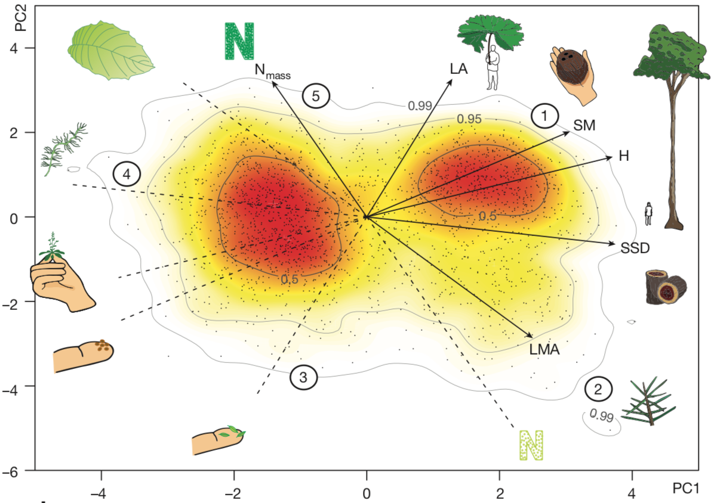
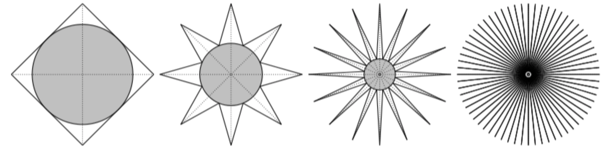
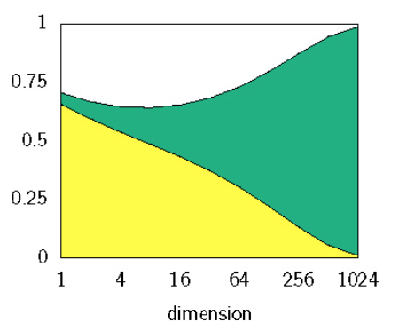

```{r, echo = FALSE, include = FALSE, warning = FALSE, message = FALSE}
library(dimRed)
library(ggplot2)
library(knitr)
library(plotly)
library(vegan)
opts_chunk$set(
  echo = FALSE,
  error = FALSE,
  message = FALSE,
  warning = FALSE,
  include = TRUE,
  results = TRUE,
  cache = TRUE,
  fig.align = "center"
)
```


# Content

- Curse of Dimensionality
  - Practical Problems
  - Theoretical Problems
- Features of Dimensionality Reduction Methods 
  - Expected Functionalities
  - Characteristics
  - Categories
- Dimensionality Reduction Methods
  - Principal Component Analysis
  - Kernal Principal Component Analysis
  - Classical Multidimensional Scaling
  - non-Metric Dimensional Scaling
- Tips for Effective Dimensionality Reduction

---


# Curse of Dimensionality

In nature combining multiple simple units allows to perform complex tasks (i.e. units are redundant and after failing can be replaced with others that achieve the same task).  

The goal of dimensionality reduction (DR) is to **summarize a large set of parameters into a smaller set with no or less redundancy** (i.e. find low representation of data while preserving it's key properties).

High dimensionality problems:  
- Practical  
- Theoretical / Mathematical

---


# Practical Problems  

*By essence, the world is multidimensional*  

- **Processing of sensor arrays**: biomedical applications; ecology; seismology; weather forecasting; gps; image processing.
- **Multivariate data analysis**: in contrast with sensor arrays multivariate data analysis focuses on the analysis of measures that are related to each other, but come from different types of sensors.
- **Data mining**: deals with more *exotic* data structures than arrays of numbers (e.g. text mining).

```{r, out.width = 400}

```

---


# Theoretical Problems
## Curse of dimensionality & mathematical anomalies 

*When the dimensionality grows, the well-known properties of the usual 2D or 3D Euclidean spaces make way for strange and annoying phenomena*

First time term *curse of dimensionality* used by [Bellman, 1961](https://books.google.be/books?hl=en&lr=&id=iwbWCgAAQBAJ&oi=fnd&pg=PR9&ots=bDH6UqK66h&sig=2JT8vX8dg1-8jSqkwY9ACw3bbnc&redir_esc=y#v=onepage&q=curse&f=false) for an empty space phenomenon:

```{r, out.width = 1000, out.height = 300}
include_graphics("./figures/bellman.png")
```

---


# Theoretical Problems
## Ratio of hyper-cube & hyper-sphere

In a $D$-dimensional space a sphere contains a cube (i.e. circumscripted cube): 

$V_{cube}\left(r\right) = \left(2r\right)^D$

$V_{sphere}\left(r\right) = \frac{\pi^{D/2}r^D}{\Gamma\left(1+ D / 2r\right)^D}$  

When $D$ increases the ratio between volume of sphere and cube goes towards zero:

$\lim_{D\to\infty} \frac{V_{sphere}\left(r\right)}{V_{cube}\left(r\right)} = 0$

---


# Theoretical Problems
## Ratio of hyper-cube & hyper-sphere

Implementation in `R`:
```{r, echo = TRUE}
volume_hypersphere <- function(r, D) {
  numer <- pi^(D / 2)
  denum <- gamma(D / 2 + 1)
  numer / denum * r^D
}
volume_hypercube <- function(r, D) {
  (2 * r)^D
}
# Ratio from $D = 2$ to $D = 10$
```
```{r, include = TRUE}
round(sapply(2:10, function(D) {volume_hypersphere(10, D) / volume_hypercube(10, D)}), 3)

```

---


# Theoretical Problems
## Hypervolume of a spherical shell

2 concentric spheres (first with radius $r$, second with slightly smaller radius $r - \epsilon$) (i.e. $\epsilon$ is the thickness of the first sphere). 

$\frac{V_{spehere}\left(r\right) - V_{spehere}\left(r\left(1 - \epsilon\right)\right)}{V_{spehere}\left(r\right)} = \frac{r^D - \left(r-\epsilon\right)^D}{r^D}$

When $D$ increases the ratio tends to go towards $1$ (the shell contains almost all the volume).

```{r, out.height = 250, out.width = 400}

```
Probability mass versus dimension plot shows the volume of density inside $0.95$ of a SD (yellow), between $0.95$ and $1.05$ SD (green), over $1.05$ SD (white) [Bishop, 1995](http://citeseerx.ist.psu.edu/viewdoc/download?doi=10.1.1.679.1104&rep=rep1&type=pdf)

---


# Features of DR Methods
## Expected Functionalities

Goal of DRM is to **identify and eliminate the redundancies among the variables**. This requires:  
1. Estimate the number of latent variables.
2. Embed data in order to reduce their dimensionality.
3. Embed data in order to recover the latent variable.

There's no *ideal* method that can perform all three tasks.

---


# Expected Functionalities
## Estimation of the Number of Latent Variables

A certain process in nature may be generated from a small set of independent degrees of freedom, but it will usually appear in a more complex way due to a number of reasons:  

- Measurement procedure
- Stochastic variation

A sample of $D$-dimensional vectors that has been generated by an unknown distribution. We assume that this distribution in data space is actually due to a small number $L < D$ of variables acting in combination, called **latent variables**. DR is achieved by defining a reverse mapping from data space onto latent space, so that every data point is assigned a representative in latent space.  

---


# Expected Functionalities
## Estimation of the Number of Latent Variables

The number of latent variables can be computed from a topological point of view, by estimating the intrinsic dimension(ality) of data. This intrinsic dimension $P$ of data equals the dimension $D$ of the embedding space, there is no structure. On the contrary, when $P < D$, data points are often constrained to lie in a well-delimited subspace. Consequently, a low intrinsic dimension indicates that a topological object or structure underlies the data set.  

```{r, out.height = 400}
swissRoll <- loadDataSet("Swiss Roll")
pd <- data.frame(swissRoll@data, swissRoll@meta)
plot_ly(x = pd$x, y = pd$y, z = pd$z, type = "scatter3d", mode = "markers", color = pd$x.1)
```

---


# Expected Functionalities
## Estimation of the Number of Latent Variables

Usually manifold is twisted or curved and points on it will be non-uniformly distributed
Different approaches have been developed to cope with the ID estimation problem:  
- Projection techniques look for the best subspace to project the data by:  

1. Minimizing a reconstruction error (e.g. In PCA can be computed from the eigenvalues)
2. Preserving pairwise distances (e.g MDS)

- Fractal methods (Hausdorff dimension): based on the idea that the volume of a $D$-dimensional ball of radius $r$ scales as $r^D$, they count the number of points within a neighborhood of $r$ and estimate the rate of growth of this number [Grassberg and Procaccia, 1981](https://journals.aps.org/prl/abstract/10.1103/PhysRevLett.50.346)

---


# Expected Functionalities
## Embedding Data for Dimensionality Reduction

If there is a low $L$-dimensional hidden space where the real data generation mechanism lies, but we observe the data in a high $D$-dimensional space. There is a function $f: R^L \Rightarrow R^D$ which is called embedding function which takes the data from $L$-dimensional and maps to the high dimensional observable one as $y_i = f(x_i) + \epsilon_i$.

DR aims to re-embed data in such way that the manifold structure is preserved (the main problem is how to measure or characterize the structure of a manifold in order to preserve it).  

```{r, out.width = 300}
pd <- embed(swissRoll, "MDS")
pd2 <- data.frame(pd@data@data, pd@data@meta)
ggplot(pd2, aes(MDS1, MDS2, color = x)) +
  geom_point() +
  scale_color_viridis_c() +
  labs(
    color = NULL
  ) +
  theme_classic()
```

---


# Expected Functionalities
## Embedding for Latent Variable Separation

Additional constraints can be imposed on the desired $L$-dimension representation (generally not related to topology). For example, it is often assumed that the latent variables are independent from each other. In this case, the $L$-dimensional representation must also satisfy this property in order to state that the latent variables have been retrieved.

---


# Characteristics

1. The model that data are assumed to follow.

All methods expect that data sets are generated according to some specific model (e.g. linear / non-linear; continuous / discrete)

2. The type of algorithm that identifies the model parameters.

*Batch methods* - can't start working until the whole set of data is available.  
*Online methods* - used when data samples arrive one by one. Each time a new datum is available, online algorithms handle it independently from the previous ones and then ‘forget’ it. Unfortunately, such algorithms don't show the same desirable properties as algebraic procedures:  

- By construction, they work iteratively (with a stochastic gradient descent).
- Can fall in a local optimum of the criterion, (find a solution that is not exactly the best, but only an approximation).
- Often require a careful adjustment of several hyperparameters to fasten the convergence and avoid the above-mentioned local minima.  

3. The criterion to be optimized, which guides the algorithm.

Criterion is a *"measurement"* to be optimized.

1. *Mean square error*.  In order to compute it, the dimensionality is first reduced and then expanded back (provided that the data model could be reversed). Most often the loss of information or deterioration of the data structure occurs solely in the first step, but the second is necessary in order to have a comparison reference.

$E_{codec} = E_y\{\Vert y - dec\left(cod\left(y\right)\right)\Vert^2_2\}$

2. *Variance* - one may wish to get a projection that preserves the variance initially observable in the raw data.

3. From a more geometrical or topological point of view, the projection of the object should preserve its structure, for example, by preserving the *pairwise distances* measured between the observations in the data set.

4. If the aim is latent variable separation, then the criterion can be *decorrelation*. This criterion can be further enriched by making the estimated latent variables as independent as possible (independent component analysis [ICA](https://en.wikipedia.org/wiki/Independent_component_analysis)).

---


# Categories 
## Hard & Soft DR

Dimensionality reduction can be hard or soft [12], de- pending on the ratio of dimensionalities before and after reduction. Simple methods such as PCA or classical metric MDS can process very high-dimensional data and project them to very low-dimensional space, even below the intrinsic dimensionality of data. Most nonlinear methods are less robust, due to their higher model complexity, and often fail to converge if the target dimensionality is lower than the data intrinsic dimensionality. A noticible exception is t-SNE, which seems to be insensitive to the curse of dimensionality, unlike most other methods.

---

# Categories 
## Traditional vs. Generative Model

The way the method connects the latent variables with the observed ones

This connection can go in both directions:  

- From the latent to the observed variables (*generative*): More principled methods prefer the this solution (they model the observed variables as a function of the unknown latent variables). This more complex solution better corresponds to the real way data are generated.
- From the observed to the latent variables (*traditional*): is the simplest and most used one, since the method basically goes in the same direction (the goal is to obtain an estimation of the latent variables starting from the observed ones). 

https://medium.com/@mlengineer/generative-and-discriminative-models-af5637a66a3

---


# Categories 
## Linear vs. Non-linear Model

The distinction between methods based on a linear or a nonlinear model is probably the straightest way to classify them. Nonlinear methods are often more powerful than linear ones, because the connection between the latent variables and the observed ones may be much richer than a simple matrix multiplication. On the other hand, their model often comprises many parameters, whose identification requires large amounts of data.  

Here we are looking for 1-dimensional structure in 2D. The points lie along an S-shaped curve. PCA tries to describe the data with a linear 1-dimensional manifold, which is simply a line; of course a line fits these data quite bad. Isomap is looking for a nonlinear (i.e. curved!) 1-dimensional manifold, and should be able to discover the underlying S-shaped curve.

https://stats.stackexchange.com/questions/124534/how-to-understand-nonlinear-as-in-nonlinear-dimensionality-reduction

---


# Categories 
## Continuous vs. Discrete Model

*Regards models continuity*

The model of PCA is *continuous*: it is a linear transform of the variables.
Model for elf organizing maps is *discrete*: it consists of a finite set of interconnected points. When the model is continuous, the DR is often achieved by using a parameterized function or mapping between the initial and final spaces. In this case, applying the mapping to new points yields their coordinates in the embedding. With only a *discrete model*, new points can't be so easily re-embedded: an interpolation procedure is indeed necessary to embed in-between points.

https://en.wikipedia.org/wiki/Growing_self-organizing_map

--- 


# Categories 
## Implicit vs. Explicit Mapping

*Regards the way a method maps the high-and low-dimensional spaces*

Explicit methods search for an explicit transformation, also called mapping, from the original high-dimensional space to the low-dimensional space. Two different types of explicit methods ex- ist: feature selection and feature extraction. Feature selection methods select only a few attributes out of the total set of attributes, while feature extraction methods search for new features that are a combination of the original features. Given the explicit transformation of such methods, new points can be easily projected in the reduced space, using the transformation already computed. The dimensions are interpretable, still easier for feature selection than for feature extraction. Ex- plicit methods are linear as they compute a linear transformation/projection from the original space to the reduced space. They are also sometimes called “projective” methods. The explicit linear mapping from the high-dimensional original space X to the low-dimensional reduced space Y is performed through a matrix transformation/multiplication:

Implicit methods search for a low-dimensional space that best preserves certain properties of the data, like distances or neighbourhood information. The term employed for these methods is em- bedding rather than dimension reduction or mapping methods. Due to the implicit nature of the embedding, the connection to the original space is lost, i.e. no explicit mapping between the two spaces is available. The dimensions of the embeddings are difficult to interpret as they have no meaning associated to them.

---


# Categories 
## Integrated vs. External Estimation of the Dimensionality

*The presence of an estimator of the intrinsic dimensionality*

The case of PCA appears as an exception, as most other methods are deprived of an integrated estimator. Actually, they take the intrinsic dimensionality as an external hyper-parameter to be given by the user. In that sense, this hyper-parameter is preferably called the embedding dimension(ality) rather than the intrinsic dimensionality of data.

--- 


# Categories
## Global vs Local

The distinction between global and local methods lies in the definition of the objective function to be optimised by each method. While global methods try to recover the global information explicitly in the optimisation function, local methods concentrate on recovering the local structure of the data. The global structure then emerges from the continuity of the local fits. Local methods try to embed nearby points in the original space to nearby points in the reduced space. Global methods, besides capturing this same information, also try to map far away points to far away points in the embedding.

---


# Categories
## Optional vs. Mandatory Vector Quantization

When the amount of available data is very large, the user may decide to work with a smaller set of representative observations. This operation can be done automatically by applying a method of vector quantization to the data set (replaces the original observations in the data set with a smaller set of so-called prototypes or centroids). Some methods are designed in such a way that vector quantization is mandatory (SOM).

---


# Categories
## Batch vs. Online Algorithm

*Observations may arrive consecutively or the whole data set may be available at once*

- Online algorithm works on a whole dataset (e.g. PCA)
- Batch algorithm can't work until the whole set of observations is known (iterative PCA)

The behavior of true online algorithms is rather complex, especially when the data sequence does not fulfill certain conditions (e.g. stationarity or ergodicity). 

Fortunately, most online algorithms can be made batch ones using the Robbins–Monro procedure (Stochastic approximation). The latter simulates a possibly infinite data sequence by repeating a finite set of observations; by construction, this method ensures some kind of stationarity.

---


# Categories
## Exact vs. Approximate Optimization

Most often, batch algorithms result from some analytical or algebraic developments that give the solution in closed form, like PCA. Given a finite data set, which is known in advance, a batch algorithm like PCA can be proved to compute the optimal solution.  
On the opposite, online or adaptive algorithms are often associated with generic optimization procedures like stochastic gradient descent. Such procedures don't offer strong guarantees about the result (the convergence may fail).

---


# Categories
## The Type of Criterion To Be Optimized

- Pairwise distances between the points (i.e. distance preservation). As an advantage, distances are scalar values that can be easily compared to each other.
- Qualitative measure of proximities. The exact value of the distances does not matter (“From point $a$, point $b$ is closer than point $c$”)

---


# Dimensionality Reduction Methods
## Principal Component Analysis (1/2)

Is the most basic technique for DR (maybe even the oldest - [Pearson, 1901](https://www.tandfonline.com/doi/abs/10.1080/14786440109462720)). 

{width=250px}

### Goal  

Find orthonormal transformation matrix $P$ with which $Y = PX$ such that $C_Y = \frac{1}{n - 1} YY^{T}$ is diagonalized (i.e PCA tries to de-correlate the original data by finding directions in which variance in maximized (or minimized for off-diagonal))

Coveratiance matrix shows how much variables change together and we want it where:
    1. Maximum variance on the diagonal (max difference between samples);
    2. Minimum off-diagonal variance (non-zero values are caused by noise and redundancy).   

$C_Y = \frac{1}{n - 1}YY^{T} = \frac{1}{n - 1} PX(PX)^{T} = \frac{1}{n - 1} PXX^{T}P^{T} = \frac{1}{n - 1} = PAP^{T} = \frac{1}{n - 1} V^{T}(V \Lambda V^{T})V^{T} = \frac{1}{n - 1} \Lambda$

---


# Dimensionality Reduction Methods
## Principal Component Analysis (2/2)

### Algorithm  

1. Scale - equalizes variance
2. Center - equalizes mean
3. Get similarity matrix $C_X$ (covariance, correlation, etc)
4. Calculate eigenvalues and eigenvectors
  
Complexity of PCA is [$\mathcal{O}(p^2n + p^3)$](https://stackoverflow.com/questions/20507646/how-is-the-complexity-of-pca-ominp3-n3).

Implementation in `R` with `stats::prcomp`

---


# Dimensionality Reduction Methods
## Kernal Principal Component Analysis

If groups are lineary inseperable in the input space ($R^{2}$) we can make them lineary seperable by mapping them to higher dimension space. Kernel Principal Component Analysis (kPCA) extends PCA to deal with nonlinear dependencies among variables. The idea behind kPCA is to map the data into a high dimensional space using a possibly non-linear function function $\Phi$ (??Why non-linear??) and then to perform a PCA in this high dimensional space:  

ARROWS $\Phi: R^{2} -> R^{3}$  
ARROWS $(x1, x2) -> (x1, x2, x1^2 + x2^2)$

This can be computationally expensive, but we can use *kernel trick*. If the columns of $X$ are centered around $0$, then the principal components can also be computed from the inner product matrix $K = X^TX$. Due to this way of calculating a PCA, we do not need to explicitly map all points into the high dimensional space and do the calculations there, it is enough to obtain the inner product matrix or kernel matrix $K belongs R n\times n$ of the mapped points 

Example of calculating the kernel matrix using a Gaussian kernel:

\begin{equation}
  K = \Phi(x_i)^T\Phi(x_j) = K(x_i\, x_j) = exp (- \frac{\norm{x_i - x_j}^2}{2\sigma^2})
\end{equation}

While points can't be linearly separated in low-dimensional space, they can almost always be linearly separated in higher-dimensional space (if we map them to higher-dim space it's easy to construct a hyperplane that divides the points into arbitrary clusters).

Another trick that one can use is *reprenseters theorem*.  

Implemented in R with `kernlab::kpca`

### Algorithm

1. Select kernel function
2. Calculate the kernel matrix
3. Center kernel matrix
4. Solve the eigenproblem
5. Project the data to each new dimension

Implementation in `R` with `kernlab::kpca`

---


## Classical Multidimensional Scaling

Uses an eigenvalue decomposition on a transformed distance matrix to find an embedding that maintains the distances of the distance matrix. 

### Algorithm

Given Euclidean distance matrix $D = (d_{ij})$ find $X = [x_1, ..., x_n]$ so that $\norm x_i - x_j \norm = d_{ij}$.

- Given proximity matrix $D$ set up squared matrix $D^2$
- Apply double centering:
$B=-frac{1}{2}JD^2J$ where $J$ is centering matrix
- Use eigen-decomposition and determine $n$ largest eigenvalues and corresponding eigenvectors of $B$  
- Compute $X$ by applying $X = V \lambda^frac{1}{2}$


```{r, echo = TRUE}
cmdscale_povilas <- function (D, dimensions = 2) {
  n <- attr(D, "Size")
  x <- matrix(0, n, n)
  x[lower.tri(x)] <- D^2
  x <- x + t(x)

  rm <- x * 0 + rowMeans(x)
  cm <- t(x * 0 + colMeans(x))
  B <- -(x - rm - cm + mean(x)) / 2

  e <- eigen(B, symmetric = TRUE)
  ev <- e$values[seq_len(dimensions)]
  evec <- e$vectors[, seq_len(dimensions), drop = FALSE]
  evec * rep(sqrt(ev), each = n)
}
plot(cmdscale_povilas(eurodist))
plot(stats::cmdscale(eurodist))
```

---


## non-Metric Dimensional Scaling

nMDS relies on the ranking of distances (is an optimization process minimizing *stress* function, and is solved by iterative algorithms). A solution is found such that the rank order of distances between points in the ordination match the order of dissimilarity between the points.

### Algorithm

0. Given dissimilarities matrix $D$ and number of wanted dimensions $n$
1. Generate an initial ordination of the sample units (starting configuration) $n$-dimensional space (in `R` inititial ordinatation is can be specified as `cmdscale(D, n)`)
2. Calculate the distances between each pair of sample units in the current ordination
3. Perform a monotonic regression of the distances vs. dissimilarities (Shepherd plot)
4. Calculate the stress
5. Slightly move each point in the ordination in a way that will decrease stress
6. Repeat steps 2 – 5 until stress either approaches zero or stops decreasing

There’s no way to know in advance what $n$ is (possible to use Scree plot `stress ~ n`)

```{r}
vegan::stressplot(vegan::metaMDS(dist(eurodist)), main = "Spepard diagram with monotonic regression")
```

---

## t-SNE


---


## Isomap

Isomap is similar to CS, but approximates the structure of the manifold by using geodesic distances. In Isomap graph is created by keeping only the connections between every point and its $k$ nearest neighbors to produce a $k$-nearest neighbor graph ($k$-NNG), or by keeping all distances smaller than a value $\epsilon$ producing an $\epsilon$-neighborhood graph ($\epsilon$-NNG). Geodesic distances are obtained by recording the distance on the graph and CS is used to find an embedding in fewer dimensions. Implementation in `R` with `vegan::isomap`.

??So DR is performed on a graph?? What happens with other connections? Do they become zeroes?


## LLE

Points that lie on a manifold in a high dimensional space can be reconstructed through linear combinations of their neighborhoods if the manifold is well sampled and the neighborhoods lie on a locally linear patch. These reconstruction weights, $W$, are the same in the high dimensional space as the internal coordinates of the manifold. Locally Linear Embedding (LLE); Roweis and Saul, 2000) is a technique that constructs a weight matrix $W belong R n \times n$ with elements $w_{ij}$ so that:

\begin{equation}
\end{equation}

Finally eigenvalue decomposition is applied. Is similar to Isomap but is computationally better because $W$ is sparse. Implementation in `R` with `lle::lle`.

## Laplacian Eigenmaps

A graph is constructed, usually from a distance matrix, the graph can be made sparse by keeping only the $k$ nearest neighbors, or by specifying an $\epsilon$ neighborhood. Then, a similarity matrix $W$ is calculated by using a Gaussian kernel , if $c = 2\sigma^2 = infinity$, then all distances are treated equally, the smaller $c$ the more emphasis is given to differences in distance. The degree of vertex $i$ is $d_i = \sum nj = 1 w_{ij}$ and the degree matrix, $D$, is the diagonal matrix with entries $d_i$. Then we can form the graph Laplacian $L = D − W$.  
Just like LLE Laplacian Eigenmaps avoid computational complexity by creating a sparse matrox and not having to estimate the distances between all pairs of points. Then the eigenvectors corresponding to the lowest eigenvalues larger than $0$ of the matrix $L$  are computed. Implementation in `R` with `dimRed::???`.

## Diffusion Maps

Diffusion Maps (Coifman and Lafon, 2006) takes a distance matrix as input and calculates the transition probability matrix $P$ of a diffusion process between the points to approximate the manifold. Then the embedding is done by an eigenvalue decompositon of $P$ to calculate the coordinates of the embedding. The algorithm for Diffusion Maps is similar to Laplacian Eigenmaps. Both algorithms uses the same weight matrix, Diffusion Map calculate the transition probability on the graph after $t$ time steps and do the embedding on this probability matrix. The idea is to simulate a diffusion process between the nodes of the graph, which is more robust to short-circuiting than the $k$-NNG from Isomap. Implementation in `R` with `diffusionMap::diffuse`.


## Force Directed Methods


## ICA

## Dimensionality Reducation via Regression

## Auto Encoder

## Independent Component Analysis


# Tips for Effective Dimensionality Reduction
## Choose an Appropriate Method 

- Nature of input data (continuous, categorical, count, distance data).
- When multidomain data is available (gene expression + proteomics), one might apply DR to each dataset separately and then align them using *a Procrustes transformation*](https://onlinelibrary.wiley.com/doi/abs/10.1002/bs.3830070216) or methods that allow integration of multiple datasets such as the conjoint analysis method for multiple tables known a STATIS (computes Euclidean distances between configurations of the same observations obtained in $K$ different circumstances, and thus handles three-way data as a set of $K$ matrices.)
- Resolution of the data (DR methods can be focused on recovering either global or local structures in the data).
- If observations in data have assigned class labels (and goal is to obtain a representation that best separates them into known categories) use *supervised DR techniques*. For example: partial least squares (PLS), linear discriminant analysis (LDA), neighborhood component analysis (NCA) and the bottleneck neural network classifier.

---


# Tips for Effective Dimensionality Reduction
## Preprocess Continuous and Count Input Data

Before applying DR, suitable data preprocessing is often necessary.  

- Data centering (subtracting variable means from each observation) — is a required step for PCA.
- Scaling variance (multiplying each measurement of a variable by a scalar factor so that the resulting feature has a variance of one). Ensures equal contribution from each variable, which is especially important for datasets containing heterogeneous features with highly variable ranges or distinct units, e.g., patient clinical data or environmental factors data. When the units of all variables are the same normalizing feature variances is not advised, because it results in shrinkage of features containing strong signals and inflation of features with no signal.
- log-transformation if changes in data are multiplicative (variables measure percent increase/decrease).
- Variance stabilization transformation when data exhibit a mean-variance trend in which features with higher means have higher variances.

---


# Tips for Effective Dimensionality Reduction
## Handling Categorical Input Data 

- If available measurements are categorical use Multiple Correspondence Analysis (MCA). Quantifies nominal (categorical) data by assigning numerical values to the cases (objects) and categories so that objects within the same category are close together and objects in different categories are far apart. Each object is as close as possible to the category points of categories that apply to the object. 
- Mixed dataset - factor analysis of mixed data (PCA for quantitative variables and as a MCA for qualitative variables); perform PCA on variables transformed using an *optimal quantification* (replace variane in PCA by a chi-squared distance on category frequencies).

---


# Tips for Effective Dimensionality Reduction
## Use Embedding Methods to Reduce Similarity/Dissimilarity  

Choose a dissimilarity metric that provides the best summary of data:

- Euclidian
- Manhattan (binary data)
- Jaccard (features are sparse)

---


# Tips for Effective Dimensionality Reduction
## Decide on the Number of Dimensions to Retain

First $n$ dimensions might explain an insufficient fraction of the variance, in 
which case the higher-order components should be retained.  

- The Guttman-Kaiser rule - pick PCs with eigenvalues of at least 1. 
- The elbow rule - Choose a number of dimensions so that adding another dimension doesn't give much better modeling of the data.
- Randomization methods based on eigenvalues - Randomize the values within variables in the data and conduct a PCA on the reshuffled data (perform $x$ tmrs). In each randomization, evaluated four test statistics based on the eigenvalues: (1) the observed eigenvalue for axis; (2) a Pseudo-F-ratio calculated as each eigenvalue divided by the sum of the remaining (or smaller) eigenvalues; (3) the ratio between an eigenvalue and the next adjacent eigenvalue; (4) the difference between an eigenvalue and the next adjacent eigenvalue

---


# Tips for Effective Dimensionality Reduction
## Apply the Correct Aspect Ratio for Visualizations

DR plots should obey the aspect ratio consistent with the relative amount of information explained by the output axes displayed (ie, the height-to-width ratio of a PCA plot should be consistent with the ratio between the corresponding eigenvalues).
The ordering of the dimensions is not meaningful in many optimization-based DR methods (in t-SNE, one can choose the number of output dimensions before computing the new representation, dimensions are unordered and equally important).

---


# Tips for Effective Dimensionality Reduction
## Understanding the Meaning of the New Dimensions

Feature maps or correlation circles can be used to determine which original variables are associated with each other or with the newly generated output dimensions. The angles between the feature vectors or with the PC axes are informative: vectors at approximately 0 (180) with each other indicate that the corresponding variables are closely, positively (negatively) related, whereas vectors with a 90 angle indicate rough independence.  


---


# Tips for Effective Dimensionality Reduction
## Finding Hidden Signal

If our goal is to identify discrete clusters it's common practice to first apply PCA (intended as a noise-reduction step). This property does not extend to all DR methods. The output generated by neighborhood embedding techniques, such as t-SNE, should not be used for clustering, as they preserve neither distances nor densities.  

Unlike discrete clusters, continuous changes in the data are less frequently identified. It is important to know how to identify and accurately interpret latent gradients, as they often appear in biological data associated with unknown continuous processes. Gradients are present when data points don't separate into distinct tightly packed clusters but instead exhibit a gradual shift from one extreme to another.


The variable behind the observed continuous gradient could be unknown. In this case, one should focus on finding the discrepancies between the observations at the endpoints (extremes) of the gradients by inspecting the differences between their values for any available external covariates. 

---


# Tips for Effective Dimensionality Reduction
## Checking the Robustness of Results and Quantify Uncertainties

- It multiple PCs have very similar variances, and the corresponding eigenvalues are almost exactly the same then their loadings can't be interpreted separately.
- When working with techniques that require parameter specification, one should also check the stability of results against different parameter settings (e.g. perplexity in t-SNE).
- Additionally, one can estimate the uncertainties associated with observations by constructing a collection of "bootstrap" datasets, i.e., random subsets of the data generated by resampling observations with replacement. 


---
