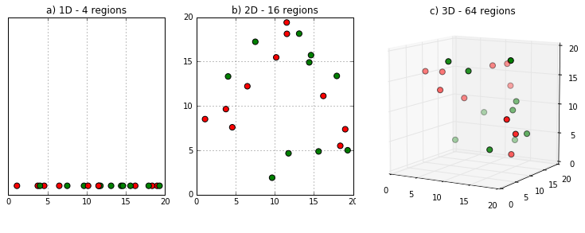
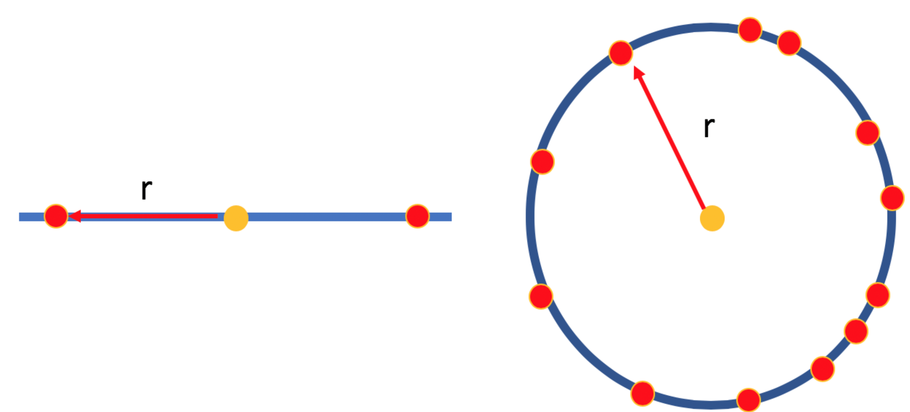
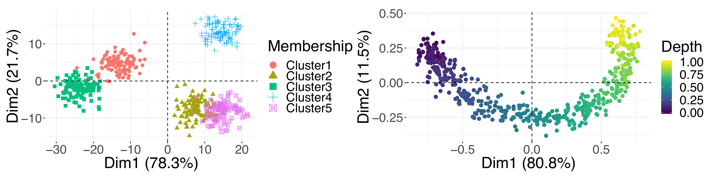
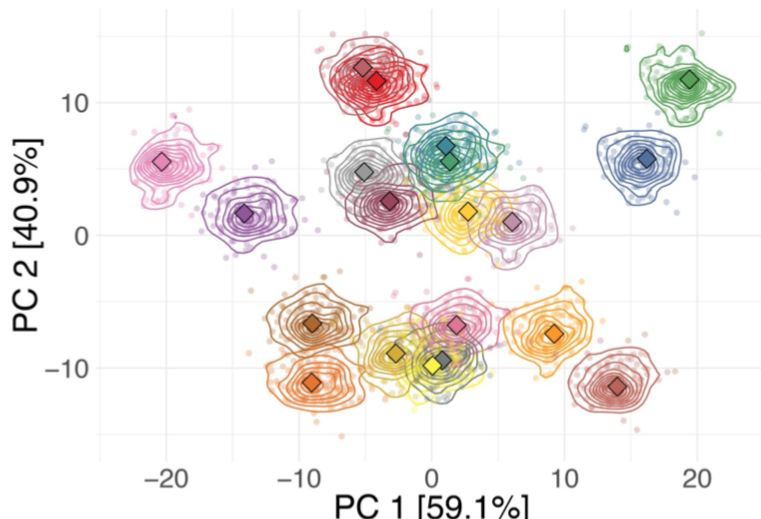

```{r, echo = FALSE, include = FALSE, warning = FALSE, message = FALSE}
library(dimRed)
library(ggplot2)
library(knitr)
library(plotly)
library(vegan)
opts_chunk$set(
  echo = FALSE,
  error = FALSE,
  message = FALSE,
  warning = FALSE,
  include = TRUE,
  results = TRUE,
  cache = TRUE,
  fig.align = "center"
)
```


# Content

- Curse of Dimensionality
  - Practical Problems
  - Theoretical Problems
- Features of Dimensionality Reduction Methods 
  - Expected Functionalities
  - Characteristics
  - Categories
- Dimensionality Reduction Methods
  - Principal Component Analysis
  - Kernel Principal Component Analysis
  - Classical Multidimensional Scaling
  - non-Metric Dimensional Scaling
  - Locally Linear Embedding
  - t-Distributed Stochastic Neighbor Embedding
- Tips for Effective Dimensionality Reduction

---


# Curse of Dimensionality

In nature combining multiple simple units allows to perform complex tasks (i.e. units are redundant and after failing can be replaced with others that achieve the same task).  

The goal of dimensionality reduction (DR) is to **summarize a large set of parameters into a smaller set with no or less redundancy** (i.e. find low representation of data while preserving it's key properties).

High dimensionality problems:  
- Practical  
- Theoretical / Mathematical

---


# Practical Problems  

*By essence, the world is multidimensional*  

- **Processing of sensor arrays**: biomedical applications; ecology; seismology; weather forecasting; gps; image processing.
- **Multivariate data analysis**: in contrast with sensor arrays multivariate data analysis focuses on the analysis of measures that are related to each other, but come from different types of sensors.
- **Data mining**: deals with more *exotic* data structures than arrays of numbers (e.g. text mining).

```{r, out.width = 400}

```

---


# Theoretical Problems
## Curse of dimensionality & mathematical anomalies 

*When the dimensionality grows, the well-known properties of the usual 2D or 3D Euclidean spaces make way for strange and annoying phenomena*

First time term *curse of dimensionality* used by [Bellman, 1961](https://books.google.be/books?hl=en&lr=&id=iwbWCgAAQBAJ&oi=fnd&pg=PR9&ots=bDH6UqK66h&sig=2JT8vX8dg1-8jSqkwY9ACw3bbnc&redir_esc=y#v=onepage&q=curse&f=false) for an empty space phenomenon:

```{r, out.width = 1000, out.height = 300}

```

---


# Theoretical Problems
## Ratio of hyper-cube & hyper-sphere

In a $D$-dimensional space a sphere contains a cube (i.e. circumscripted cube): 

$V_{cube}\left(r\right) = \left(2r\right)^D$

$V_{sphere}\left(r\right) = \frac{\pi^{D/2}r^D}{\Gamma\left(1+ D / 2r\right)^D}$  

When $D$ increases the ratio between volume of sphere and cube goes towards zero:

$\lim_{D\to\infty} \frac{V_{sphere}\left(r\right)}{V_{cube}\left(r\right)} = 0$

---


# Theoretical Problems
## Ratio of hyper-cube & hyper-sphere

Implementation in `R`:
```{r, echo = TRUE}
volume_hypersphere <- function(r, D) {
  numer <- pi^(D / 2)
  denum <- gamma(D / 2 + 1)
  numer / denum * r^D
}
volume_hypercube <- function(r, D) {
  (2 * r)^D
}
# Ratio from $D = 2$ to $D = 10$
```
```{r, fig.asp = 0.4, out.width = 700, include = TRUE}
round(sapply(2:10, function(D) {volume_hypersphere(10, D) / volume_hypercube(10, D)}), 3)

```

---


# Theoretical Problems
## Hypervolume of a spherical shell

2 concentric spheres (first with radius $r$, second with slightly smaller radius $r - \epsilon$) (i.e. $\epsilon$ is the thickness of the first sphere). 

$\frac{V_{spehere}\left(r\right) - V_{spehere}\left(r\left(1 - \epsilon\right)\right)}{V_{spehere}\left(r\right)} = \frac{r^D - \left(r-\epsilon\right)^D}{r^D}$

When $D$ increases the ratio tends to go towards $1$ (the shell contains almost all the volume).

```{r, out.height = 250, out.width = 400}

```
Probability mass versus dimension plot shows the volume of density inside $0.95$ of a SD (yellow), between $0.95$ and $1.05$ SD (green), over $1.05$ SD (white) [Bishop, 1995](http://citeseerx.ist.psu.edu/viewdoc/download?doi=10.1.1.679.1104&rep=rep1&type=pdf)

---


# Features of DR Methods
## Expected functionalities

Goal of DRM is to **identify and eliminate the redundancies among the variables**. This requires:  
1. Estimate the number of latent variables.
2. Embed data in order to reduce their dimensionality.
3. Embed data in order to recover the latent variable.

There's no *ideal* method that can perform all three tasks.

---


# Expected Functionalities
## Estimation of the number of latent variables

A certain process in nature may be generated from a small set of independent degrees of freedom, but it will usually appear in a more complex way due to a number of reasons:  

- Measurement procedure
- Stochastic variation

A sample of $D$-dimensional vectors that has been generated by an unknown distribution. We assume that this distribution in data space is actually due to a small number $L < D$ of variables acting in combination, called **latent variables**. DR is achieved by defining a reverse mapping from data space onto latent space, so that every data point is assigned a representative in latent space.  

---


# Expected Functionalities
## Estimation of the number of latent variables

The number of latent variables can be computed from a topological point of view, by estimating the intrinsic dimension(ality) of data. This intrinsic dimension $L$ of data equals the dimension $D$ of the embedding space, there is no structure. On the contrary, when $L < D$, data points are often constrained to lie in a well-delimited subspace. Consequently, a low intrinsic dimension indicates that a topological object or structure underlies the data set.  

```{r, out.height = 350}
data_topo <- loadDataSet("3D S Curve")
pd <- data.frame(data_topo@data, data_topo@meta)
plot_ly(x = pd$x, y = pd$y, z = pd$z, type = "scatter3d", mode = "markers", color = pd$x.1)
```

---


# Expected Functionalities
## Estimation of the number of latent variables

Usually manifold is twisted or curved and points on it will be non-uniformly distributed
Different approaches have been developed to cope with the ID estimation problem:  
- Projection techniques look for the best subspace to project the data by:  

1. Minimizing a reconstruction error (e.g. In PCA can be computed from the eigenvalues)
2. Preserving pairwise distances (e.g MDS)

- Fractal methods (Hausdorff dimension): based on the idea that the volume of a $D$-dimensional ball of radius $r$ scales as $r^D$, they count the number of points within a neighborhood of $r$ and estimate the rate of growth of this number [Grassberg and Procaccia, 1981](https://journals.aps.org/prl/abstract/10.1103/PhysRevLett.50.346)

---


# Expected Functionalities
## Embedding data for dimensionality reduction

If there is a low $L$-dimensional hidden space where the real data generation mechanism lies, but we observe the data in a high $D$-dimensional space. There is a function $f: R^L \Rightarrow R^D$ which is called embedding function which takes the data from $L$-dimensional and maps to the high dimensional observable one as $y_i = f(x_i) + \epsilon_i$.

DR aims to re-embed data in such way that the manifold structure is preserved (the main problem is how to measure or characterize the structure of a manifold in order to preserve it).  

```{r, out.width = 400, fig.asp = 0.6, dpi = 200}
pd <- embed(data_topo, "Isomap")
pd2 <- data.frame(pd@data@data, pd@data@meta)
ggplot(pd2, aes(iso.1, iso.2, color = x)) +
  geom_point() +
  scale_color_viridis_c() +
  labs(
    x = "Dimension1", 
    y = "Dimension2", 
    color = NULL
  ) +
  theme_classic()
```

---


# Expected Functionalities
## Embedding for latent variable separation

Additional constraints can be imposed on the desired $L$-dimension representation (generally not related to topology). For example, it is often assumed that the latent variables are independent from each other. In this case, the $L$-dimensional representation must also satisfy this property in order to state that the latent variables have been retrieved.

---


# Characteristics
## The model that data are assumed to follow

All methods expect that data sets are generated according to some specific model (e.g. linear / non-linear; continuous / discrete)

## The type of algorithm

- Batch methods - can't start working until the whole set of data is available.  
- Online methods - used when data samples arrive one by one. Each time a new sample is available, online algorithms handle it independently from the previous ones. Unfortunately, such algorithms don't show the same desirable properties as algebraic procedures:  

  - Can fall in a local optimum of the criterion, (find a solution that is not exactly the best, but only an approximation).
  - Often require a careful adjustment of several hyperparameters to fasten the convergence.  


---


# Characteristics
## The criterion to be optimized

- Mean square error - In order to compute it, the dimensionality is first reduced and then expanded back (provided that the data model could be reversed).

$E_{codec} = E_y\{\Vert y - dec\left(cod\left(y\right)\right)\Vert^2_2\}$

- Variance - Projection that preserves the variance initially observable in the raw data.

- Pairwise distances - measured between the observations in the data set (from a topological point of view, the projection of the object should preserve its structure)

- Decorrelation - if the aim is latent variable separation. This criterion can be further enriched by making the estimated latent variables as independent as possible [independent component analysis](https://en.wikipedia.org/wiki/Independent_component_analysis).

---


# Categories 
## Hard & soft DR

DR can be hard or soft, depending on the ratio of dimensionalities before and after reduction.
- Hard DR is suited for problems in which data have from hundreds to hundred of thousands of variables. In such a case, a drastic DR is performed (several orders of magnitude). Simple methods such as PCA or classical MDS can process very high-dimensional data and project them to very low-dimensional space. Most nonlinear methods are less robust, due to their higher model complexity, and often fail to converge.
- Soft DR is suited for problems in which the data aren't too high-dimensional (less than a few tens of variables). Usually, the components are observed or measured values of different variables, which have a straightforward interpretation.

---


# Categories 
## Linear & non-linear model

The distinction between methods based on a linear or a nonlinear model is probably the straightest way to classify them.  
Nonlinear methods are often more powerful than linear ones, because the connection between the latent variables and the observed ones may be much richer than a simple matrix multiplication.

```{r, fig.asp = 0.4, dpi = 200}
pd <- loadDataSet("3D S Curve", n = 1000) %>%
  embed("PCA")
pd <- data.frame(pd@data@data)
ggplot(pd, aes(PC1, PC2)) +
  geom_point() +
  scale_color_viridis_c() +
  labs(
    x = "Dimension1", 
    y = "Dimension2"
  ) +
  theme_classic()
```

---


# Categories 
## Continuous & discrete model

*Regards models continuity*

- Continous - DR is often achieved by mapping between the initial and final spaces (linear transformation in PCA).
- Discrete model consists of a finite set of interconnected points (e.g self organizing maps).

## Estimation of the dimensionality

*The presence of an estimator of the intrinsic dimensionality*

Most of the methods (except PCA) need the embedding dimension as an external hyper-parameter to be given by the user.

---


# Categories 
## Implicit vs. explicit mapping

- Explicit methods search for mapping, from the original high-dimensional space to the low-dimensional space:
1. Feature selection methods select only a few attributes of the total set of attributes. 
2. Feature extraction methods search for new features that are a combination of the original features. 
- Implicit methods search for a low-dimensional space that best preserves certain properties of the data, like distances or neighbourhood information. The term employed for these methods is em- bedding rather than dimension reduction or mapping methods.

---


# Categories
## Global & local methods

- Global methods try to recover the global information explicitly in the optimisation function.
- Local methods concentrate on recovering the local structure of the data, the global structure then emerges from the continuity of the local fits.

## Optional & mandatory vector quantization

When the amount of available data is very large one may work with a smaller set of representative observations - vector quantization can be applied (replaces the original observations in the data set with a smaller set of so-called prototypes or centroids).

---


# Categories
## Batch & online algorithm

*Observations may arrive consecutively or the whole data set may be available at once*

- Online algorithm works on a whole dataset (e.g. PCA)
- Batch algorithm can't work until the whole set of observations is known (iterative PCA)

The behavior of true online algorithms is rather complex, especially when the data sequence does not fulfill certain conditions (e.g. stationarity). 

Fortunately, most online algorithms can be made batch ones using the Robbins–Monro procedure (Stochastic approximation). The latter simulates a possibly infinite data sequence by repeating a finite set of observations; by construction, this method ensures some kind of stationarity.

---


# Categories
## Exact vs. approximate optimization

- Most often, batch algorithms result from some analytical or algebraic developments that give the solution in closed form, like PCA. Given a finite data set, which is known in advance, can compute the optimal solution.  
- On the opposite, online or adaptive algorithms are often associated with generic optimization procedures like stochastic gradient descent. Such procedures don't offer strong guarantees about the result (the convergence may fail).

## Criterion To Be Optimized

- Pairwise distances between the points (i.e. distance preservation). As an advantage, distances are scalar values that can be easily compared to each other.
- Qualitative measure of proximities. The exact value of the distances does not matter ("Distance from point $a$, point $b$ is closer than point $c$").

---


# Principal Component Analysis

Is the most basic technique for DR (maybe even the oldest - [Pearson, 1901](https://www.tandfonline.com/doi/abs/10.1080/14786440109462720)). 

```{r, out.height = 250, out.width = 400}

```

### Goal  

Find orthonormal transformation matrix $P$ with which $Y = PX$ such that $C_Y = \frac{1}{n - 1} YY^{T}$ is diagonalized (i.e PCA tries to de-correlate the original data by finding directions in which variance in maximized (or minimized for off-diagonal))

???

Coveratiance matrix shows how much variables change together and we want it where:
    1. Maximum variance on the diagonal (max difference between samples);
    2. Minimum off-diagonal variance (non-zero values are caused by noise and redundancy).   

---


# Principal Component Analysis
### Algorithm  

1. Scale - equalizes variance
2. Center - equalizes mean
3. Get similarity matrix $C_X$ (covariance, correlation, etc)
4. Calculate eigenvalues and eigenvectors
  
$C_Y = \frac{1}{n - 1}YY^{T} = \frac{1}{n - 1} PX(PX)^{T} = \frac{1}{n - 1} PXX^{T}P^{T} \\ \hspace{7.4mm} = \frac{1}{n - 1} PAP^{T} = \frac{1}{n - 1} V(V \Lambda V^{T})V^{T} = \frac{1}{n - 1} \Lambda$

Complexity of PCA is $\mathcal{O}(p^2n + p^3)$.  
Implementation in `R` with `stats::prcomp`

### Assumptions 
- Linearity
- Large variances have important structure

---


# Kernel Principal Component Analysis

If groups are lineary inseperable in the input space $R^{2}$ we can make them lineary seperable by mapping them to a higher dimension space $R^3$. kPCA extends PCA to deal with nonlinear dependencies - map the data into a high dimensional space and then perform PCA in this space ([Scholkopf et al., 1998](http://www.face-rec.org/algorithms/Kernel/kernelPCA_scholkopf.pdf)):  

$\Phi: R^{2} \Rightarrow R^{3}$  
$(x_1, x_2) \Rightarrow (x_1, x_2, x_1^2 + x_2^2)$

```{r, out.height = 250, out.width = 400}

```

---


# Kernel Principal Component Analysis

This can be computationally expensive, but we can use *kernel trick* - the principal components can also be computed from the inner product matrix $K = X^TX$. Here we don't need to explicitly map all points into the high dimensional space and do the calculations there, it is enough to obtain the kernel matrix. 

Example of calculating the kernel matrix using a Gaussian kernel:

$K = K(x_i\, x_j) = \Phi(x_i)^T\Phi(x_j) = exp (- \frac{\lVert x_i - x_j\rVert ^2}{2\sigma^2})$

### Algorithm

1. Select kernel function
2. Calculate the kernel matrix
3. Center kernel matrix
4. Solve the eigenproblem
5. Project the data to each new dimension

Implementation in `R` with `kernlab::kpca`

---


# Classical Multidimensional Scaling

Uses an eigenvalue decomposition on a transformed distance matrix to find an embedding that maintains the distances of the distance matrix. 

### Algorithm

Given Euclidean distance matrix $D = (d_{ij})$ find $X = [x_1, ..., x_n]$ so that $\lVert x_i - x_j \rVert = d_{ij}$.

- Given proximity matrix $D$ set up squared matrix $D^2$
- Apply double centering:
$B=-\frac{1}{2}JD^2J$, where $J$ is centering matrix
- Use eigen-decomposition and determine $n$ largest eigenvalues and corresponding eigenvectors of $B$  
- Compute $X$ by applying $X = V \Lambda^\frac{1}{2}$

---


# Classical Multidimensional Scaling

```{r, echo = TRUE, include = TRUE}
cmdscale_povilas <- function(D, dimensions = 2) {
  n <- attr(D, "Size")
  x <- matrix(0, n, n)
  x[lower.tri(x)] <- D^2
  x <- x + t(x)

  rm <- x * 0 + rowMeans(x)
  cm <- t(x * 0 + colMeans(x))
  B <- -(x - rm - cm + mean(x)) / 2

  e <- eigen(B, symmetric = TRUE)
  ev <- e$values[seq_len(dimensions)]
  evec <- e$vectors[, seq_len(dimensions), drop = FALSE]
  evec * rep(sqrt(ev), each = n)
}
mean(cmdscale_povilas(eurodist) - stats::cmdscale(eurodist))
```

---


# non-Metric Dimensional Scaling
nMDS relies on the ranking of distances (is an optimization process minimizing *stress* function, and is solved by iterative algorithms). A solution is found such that the rank order of distances between points in the ordination match the order of dissimilarity between the points.

### Algorithm

Given dissimilarities matrix $D$ and number of wanted dimensions $n$

1. Generate an initial ordination of the sample units (starting configuration) in $n$-dimensional space (in `R` can be specified as `cmdscale(D, n)`)
2. Calculate the distances between each pair of sample units in the current ordination
3. Perform a monotonic regression of the distances vs. dissimilarities (Shepherd plot)
4. Calculate the stress
5. Slightly move each point in the ordination in a way that will decrease stress
6. Repeat steps 2 – 5 until stress either approaches zero or stops decreasing

---


# non-Metric Dimensional Scaling

There’s no way to know in advance what $n$ is (possible to use Scree plot `stress ~ n`).

Implementation in `R` with `vegan::monoMDS`.

```{r, out.height = 200, out.width = 450, dpi = 400}

# vegan::stressplot(vegan::metaMDS(dist(eurodist)), main = "Shepard diagram with monotonic regression")
```

---


# Locally Linear Embedding

Points that lie on a manifold in a high dimensional space can be reconstructed through linear combinations of their neighborhoods. Makes assumption that "expect each data point and its neighbors to lie on or close to a locally linear patch of the manifold".

### Algorithm

1. Compute the neighbors of each data point $\vec{x}_{\,i}$ (number of neighbors is the only needed parameter)
2. Compute the weights $W_{ij}$ that best reconstruct each data point $\vec{x}_{\,i}$ from its neighbors
3. Compute the vectors $\vec{y}_{\,i}$ best reconstructed by the weights $W_{ij}$
4. Apply eigenvalue decomposition.

Is similar to Isomap but is computationally better because $W$ is sparse. Implementation in `R` with `lle::lle`.

---

# t-dist Stochastic Neighbor Embedding

Uses the local relationships between points to create a low-dimensional mapping and this allows it to capture non-linear structure.  

Why not LLE or kPCA?
- Handles the crowding problem very well (makes the optimization "spread-out" the medium distance points to prevent crowding).
- Uses "stochastic neighbors" - there is no clear line between which points are neighbors of the other points (takes both global and local structure into account).


```{r, out.height = 200, out.width = 450, dpi = 400}

````

---


# t-dist Stochastic Neighbor Embedding
### Algorithm

- In the high-dimensional space, create a probability distribution that dictates the relationships between various neighboring points

1. Pick point $x_i$
2. Define the probability of picking another point $x_j$ in the dataset as the neighbor:
$p_{ij} = \frac{\exp(-\left \| x_i - x_j \right \|^2 / 2\sigma_i^2)}{\sum_{k \neq l} \exp(- \left \| x_k - x_l \right \|^2 / 2\sigma_i^2)}$

Probability is proportionate to the probability density of a Gaussian centered at $x_i$ and $\sigma_i$ is calculated using hyperparameter *perplexity*.

- Recreate a low dimensional space that follows that probability distribution as best as possible.

1. Use Student t-distribution with a single degree of freedom (A Gaussian distribution has a "short tail", meaning nearby points are likely to be squashed together):
$q_{ij} =\frac{(1 + \left \| y_i - y_j \right \|^2 )^{-1}}{\sum_{k \neq l} (1 + \left \| y_k - y_l \right \|^2 )^{-1} }$

---


# t-dist Stochastic Neighbor Embedding
### Algorithm

2.1 Optimize the distribution according to Kullback–Leibler divergence:

$D_{\text{KL}}(P\parallel Q)=\sum _{x\in {\mathcal {X}}}P(x)\log \left({\frac {P(x)}{Q(x)}}\right)$

2.2 "Early compression" penalty - Adds penalty to the cost function at the early stages of optimization to make the distance between embedded points remain small. 

2.3 "Early exaggeration" - all the $p_{ij}$ are exaggerated at the early stages of optimization. The effect of this is to force the values of $q_{ij}$ to become more focused on larger $p_{ij}$

---


# t-dist Stochastic Neighbor Embedding
### Interpretation

- Hyperparameters are important

```{r, out.height = 140, out.width = 1000, dpi = 400}

````
- Cluster sizes in mean nothing

```{r, out.height = 140, out.width = 1000, dpi = 400}

````
- Distances between clusters might not mean anything

---


# Tips for Effective DR
## Choose an appropriate method 

- Nature of input data (continuous, categorical, count, distance data).
- When multidomain data is available one might apply DR to each dataset separately and then align them using [a Procrustes transformation](https://onlinelibrary.wiley.com/doi/abs/10.1002/bs.3830070216) or methods that allow integration of multiple datasets (STATIS). 
- Resolution of the data (DR methods can be focused on recovering either global or local structures in the data).
- If observations in data have assigned class labels (and goal is to obtain a representation that best separates them into known categories) use *supervised DR techniques*. For example: partial least squares (PLS), linear discriminant analysis (LDA), neighborhood component analysis (NCA) and the bottleneck neural network classifier.

---


# Tips for Effective DR
## Preprocess continuous and count input data

Before applying DR, suitable data preprocessing is often necessary.  

- Data centering (subtracting variable means) — is a required step for PCA.
- Scaling variance (multiplying each measurement of a variable by a scalar factor so that the resulting feature has a variance of one), this ensures equal contribution from each variable. When units of all variables are the same normalizing feature variances is not advised, because it results in shrinkage of features containing strong signals and inflation of features with no signal.
- log-transformation if changes in data are multiplicative (variables measure percent increase/decrease).
- Variance stabilization transformation when data exhibit a mean-variance trend in which features with higher means have higher variances.

---


# Tips for Effective DR
## Handling categorical input data 

- If available measurements are categorical use Multiple Correspondence Analysis (MCA) - quantifies categorical data by assigning numerical values to the objects and categories so that objects within the same category are close together and objects in different categories are far apart.
- Mixed dataset - factor analysis of mixed data (PCA for quantitative variables and a MCA for qualitative variables); perform PCA on variables transformed using an *optimal quantification* (replace variance in PCA by a chi-squared distance on category frequencies).

---


# Tips for Effective DR
## Use embedding methods to reduce similarity/dissimilarity  

Choose a dissimilarity metric that provides the best summary of data:

- Euclidian
- Manhattan (binary data)
- Jaccard (features are sparse)

## Apply the correct aspect ratio for visualizations

- DR plots should obey the aspect ratio consistent with the relative amount of information explained (i.e. ratio of a plot should be consistent with the ratio between the corresponding eigenvalues).
- The ordering of the dimensions is not meaningful in many optimization-based DR methods (e.g. t-SNE).

---


# Tips for Effective DR
## Decide on the number of dimensions to retain

First $n$ dimensions might explain an insufficient fraction of the variance, in which case the higher-order components should be retained.  

- The Guttman-Kaiser rule - pick PCs with eigenvalues of at least $1$. 
- The elbow rule - Choose a number of dimensions so that adding another dimension doesn't give much better modeling of the data.
- Randomization methods based on eigenvalues - randomize the values within variables in the data and conduct a PCA on the reshuffled data. In each randomization, evaluate statistics based on the eigenvalues:
  1. Observed eigenvalue for axis.
  2. a Pseudo-F-ratio calculated as each eigenvalue divided by the sum of the remaining (or smaller) eigenvalues.
  3. The ratio (or difference) between an eigenvalue and the next adjacent eigenvalue.

---


# Tips for Effective DR

## Understanding the meaning of the new dimensions

Correlation circles can be used to determine which original variables are associated with each other or with generated dimensions. The angles between the feature vectors or with the PC axes are informative: vectors at approximately 0 (180) with each other indicate that the corresponding variables are closely, positively (negatively) related, whereas vectors with a 90 angle indicate rough independence.  

```{r, out.height = 250, out.width = 800, dpi = 400}

```

---


# Tips for Effective DR
## Finding hidden signal

- If goal is to identify discrete clusters it's a common practice to apply PCA (intended as a noise-reduction step). The output generated by neighborhood embedding techniques, such as t-SNE, should not be used for clustering, as they preserve neither distances nor densities.  
- Unlike discrete clusters, continuous changes in the data are less frequently identified.

```{r, out.height = 250, out.width = 800, dpi = 400}

```

---


# Tips for Effective DR
## Checking the robustness of results and quantify uncertainties

- If multiple PCs have very similar variances and the corresponding eigenvalues are almost exactly the same then their loadings can't be interpreted separately.
- When working with techniques that require parameter specification, one should also check the stability of results against different parameter settings, e.g., perplexity in t-SNE.
- Estimate uncertainties by constructing a collection of "bootstrap" datasets, i.e., random subsets of the data generated by resampling observations. 

```{r, out.height = 220, out.width = 350, dpi = 300}

```
